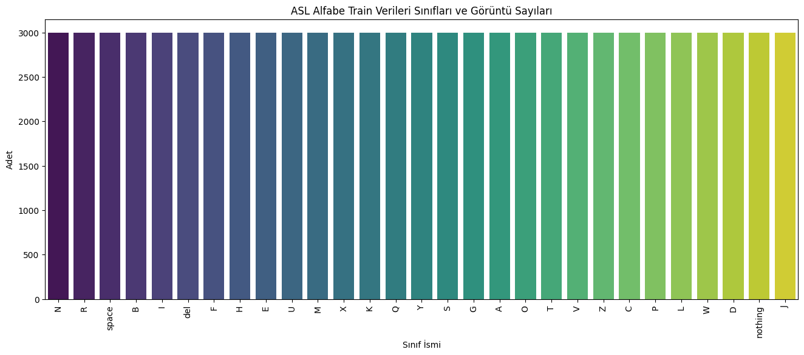
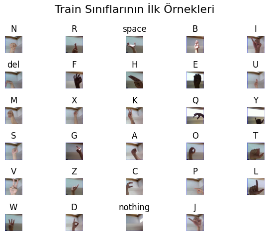
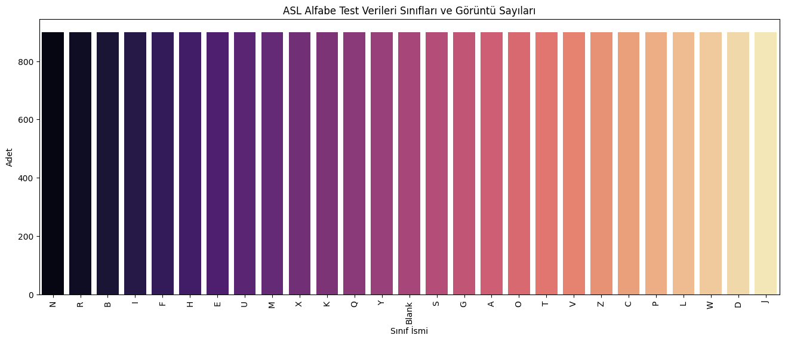
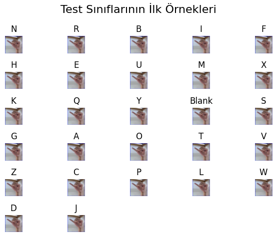

# Projenin Amacı

Akbank Derin Öğrenmeye Giriş Bootcampi kapsamında geliştirilmiş olan Bilgisayarlı görü projesidir. ASL (American Sign Language) veri seti seçilerek ASL alfabesi ile ilgili görüntülerin Yapay Zeka ile tespitinin ve sınıflandırılmasının yapılması amaçlanmıştır. Proje kapsamında Derin öğrenme, Makina öğrenmesi, Yapay Zeka, veri önişleme, veri çoğaltma, CNN mimarisi ve bileşenleri, Model Değerlendirme metrikleri ve bunların yanında pekçok alanda kullanılabilecek faydalı bilgileri teorik olarak öğrenip pratik olarak uygulama imkanı bulunmuştur.

# ASL Alphabet Veri Seti

Train ve test işlemleri için iki adet veri seti kullanılmıştır. Bunun sebebi train için seçilmiş olan veri setinin test verisi ile ayrılammış olmasından kaynaklanmaktadır. asl-alphabet veri seti train işlemi için, syntetich-asl-alphabet veri seti ise test işlemi için seçilmiştir. veri seti tercihinde verilerin benzerliği ve çeşitlilikleri göz önünde bulundurularak tercih edilmiştir.

## Train verileri

- Asl-alphabet veri setinde 29 adet sınıf Bulunmaktadı
- sınıf bilgileri şu şekildedir:
  
- Her sınıftan 3000 adet eğitim görüntüsüyle beraber toplamda 87000 eğitim görüntüsüne sahiptir.
  
- 200 x 200 piksel boyutundadır her bir görüntü.
- Veri Setine uygulanmış işlemler:
  - Görüntülerin simetrilerinin alınması
  - Görüntülerin 5 er derece sağa ve sola döndürülmeleri
  - Görüntülerin Parlaklık ve kontrast değerleri ile oynanması
  - Görüntülerin rgb değerleri [-1,1] aralıklarına gelecek şekilde normalize edilmiştir
  - Görüntüler Tensore formatına çevrilmiştir.
- Train verilerinin %20 si validation verisi olarak ayrılmıştır

## Test Verileri

- Syntetich-asl-alphabet veri setinde 27 adet sınıf bulunmaktadır.
- sınıf bilgileri şu şekildedir:
  
- Her sınıftan 800 adet eğitim görüntüsüyle beraber toplamda 27000 eğitim görüntüsüne sahiptir.
  
- 573 x 573 piksel boyutundadır her bir görüntü.
- Veri Setine uygulanmış işlemler:
  - Görüntülerin rgb değerleri [-1,1] aralıklarına gelecek şekilde normalize edilmiştir
  - Görüntüler Tensore formatına çevrilmiştir.

# Kullanılmış yöntemler

- PyTprch ile eğitim işlemi gerçekleştirilmiştir
- Dinamik ayarlanabilen bir CNN ağı oluşturuldu.
- Aşağıda belirtilern parametreler ve paramtere değerleri için hiper parametre optimizasyonu gerçekleştirildi
  - conv_filters_options = [[32,64],[32,64,128]]
  - dense_sizes_options = [[128],[256,128]]
  - dropouts_options = [0.3]
  - learning_rates_options = [1e-3,1e-4]
  - batch_sizes_options = [64,128]
- Hiper Parametre Optimizasyonu sonuçları şu şekildedir.

* En iyi hiperparametreler:
  {'conv_filters': [32, 64, 128], 'dense_sizes': [256, 128], 'dropout': 0.3, 'lr': 0.001, 'batch_size': 128, 'val_acc': 0.5348275862068965}

- optimizer olarak ADAM seçilmiştir.
- Aktivasyon fonksiyonu olarak RELU kullanılmıştır.
- epoch değeri 10 seçilmiştir.

# Elde edilmiş Sonuçlar.

Eğitim işleminden sonra şu sonuçlara elde edilmiştir

- Test Accuracy : 0.8013
- Test Precision: 0.8154
- Test Recall : 0.8013
- Test F1 Score : 0.7978

# kaggle_link = https://www.kaggle.com/code/furkanhazar/akbankderinogrenme/edit/run/262663795
